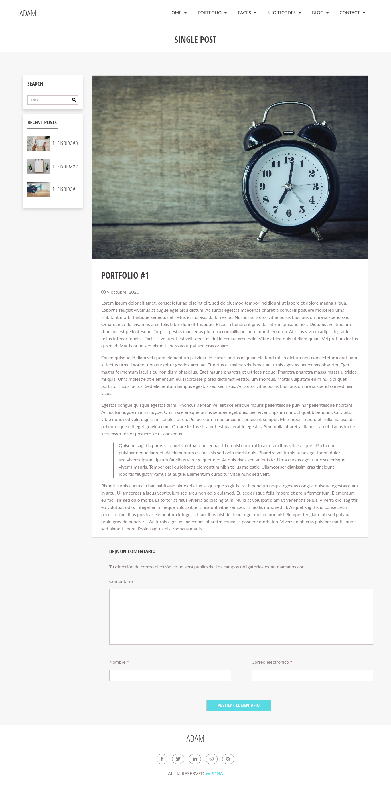

# GivingTheme

Creation of a personalized theme for the BRM Grandes Interacciones company

### Install

Next, you will find the steps to install the Giving Theme in WordPress:

1. Install WordPress on your local site or on a domain.

2. Download the Giving Theme folder on your computer and compress it, then navigate to the wp-content/ themes folder and unzip it there, also, you can upload it as a .zip file from the Wordpress administrator panel in the Appearance > Themes > option Upload topic.

3. Download the folder that is inside the Plugin folder, which you must compress and later unzip it in the wp-content/plugins folder, also, you can load it from the WordPress administrator in the option Plugins > Add new > Upload plugin, and activate it.

4. With the Portfolio plugin, you can create custom posts to manage your content in a better way, enjoy it!

5. Download the .xml file to import the content using the Tools> Import option, run the Wordpress Importer, load the .xml file you downloaded and you will be able to view the content.

Note: If you have problems importing the media, you can download the .xml file corresponding to the assets and import it again.

6. Using the option Settings> Reading, set the page "Adam" as the home page.

Ready!

### Stack

- WordPress
- PHP
- SASS
- HTML 5
- JavaScript

## Preview

### Home

### Custom Post Types / Blog Posts

## Adaptive mode

### Home

### Custom Post Types / Blog Posts

## Authors

👤 **Guiselle Mejía <guissmejia@gmail.com>**

- Github: [@guissmejia](github.com/guissmejia)
- LinkedIn: [in/guiselle-mejia](https://www.linkedin.com/in/guiselle-mejia/)

## 📝 License

Copyright © 2020 [Guiselle Mejía <guissmejia@gmail.com>](https://github.com/guissmejia).

This project is [MIT](https://github.com/guissmejia/GivingTheme/blob/main/LICENSE) licensed.
